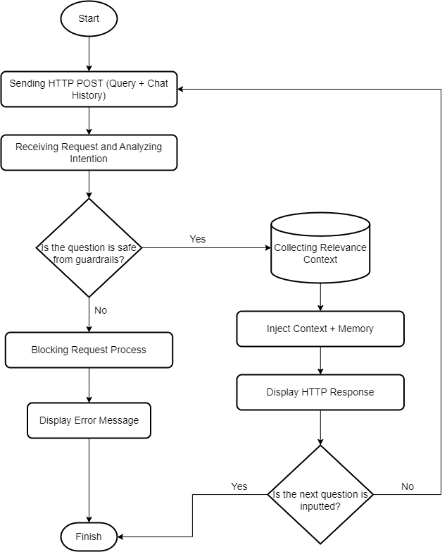

# END TO END PRODUCTION RAG SYSTEM WITH GUARDRAILS AND CONVERSATIONAL MEMORY

> Case Study: Factory Textile Defect Detection SOP Document Chatbot based on Local LLM.

## OVERVIEW
This project implements a production-grade Retrieval-Augmented Generation (RAG) system. Starting from the hyperparameter optimization experiment phase using the Optuna framework, this system has now transformed into an independent Client-Server architecture. The main focus is the implementation of Semantic Router Guardrails to prevent prompt exploitation (Adversarial Attacks) and the injection of Stateless Memory which allows the model to remember conversational history like a real virtual assistant.



## WORKFLOW
This project was built through a comprehensive development cycle:

1. Development and Experimentation Phase:
Document text is extracted and chunked using automated optimization parameters. After running 20 trials using Optuna, the most optimal configuration combination was obtained, including ```chunk_size 500```, ```chunk_overlap 50```, and ```top_k 6```. This configuration is proven to provide the highest accuracy in retrieving context without triggering hallucinations in the LLM model. The vector data is then stored into ChromaDB.

2. Production and Deployment Phase:
    * **Step 1 (Client Request)**: The user sends a question along with the conversation history through the Streamlit interface.
    * **Step 2 (Security Guardrails)**: FastAPI intercepts the input and tests it using a Semantic Router based on the all-MiniLM model. The system will evaluate manipulative intent, coding instructions, or out-of-domain topics before processing it further.
    * **Step 3 (Context Retrieval)**: If safe, the question is combined with the conversation memory and then sent to ChromaDB to search for relevant SOP chunks.
    * **Step 4 (Generation)**: The Qwen2.5 3B local LLM synthesizes the final answer based on factual documents and conversation history, then sends it back to the user.

## TECH STACKS
* Programming Language: Python
* Backend API Gateway: FastAPI and Uvicorn
* Frontend UI: Streamlit
* Vector Database: ChromaDB
* Embedding and Guardrails Engine: all-MiniLM-L6-v2
* LLM Engine: Qwen2.5 3B via Ollama
* MLOps Experiments: MLflow and Optuna
* Containerization: Docker

## SECURITY EVALUATION AND RED TEAMING
This system has been tested using Adversarial Attacks techniques to ensure its robustness in a production environment:

* **Sandwich Attack Testing**: Inserting malicious commands between small-talk sentences was successfully blocked.

* **Prompt Injection and Roleplay Testing**: Attempts to force the bot to become a code writer (XSS/SQLi) or a chef were rejected by the Guardrails security layer and the Qwen model's built-in RLHF.

> ℹ️ Security Development Note (Vulnerability Notice): The Semantic Router-based security guardrails in this project are still not fully secure from advanced bypass techniques (False Negatives). This is because the list of anchor phrases used for vector mapping is still very limited.

> ℹ️ To achieve Enterprise-level security in the future, further development is required by expanding the anomaly dataset or transitioning to a specialized NLP Classifier model for intent reading (intent classifier).

## PERFORMANCE BENCHMARK
To provide performance transparency, here are the average inference time metrics recorded during testing:

1. **Guardrail Routing Latency (all-MiniLM)**: Less than 0.1 seconds
2. **Vector Retrieval (ChromaDB)**: Around 0.5 seconds
3. **Generation Time (Qwen2.5 3B)**: 6 to 8 seconds depending on memory history length
4. **Total Average Response Time**: Around 8.5 seconds

> ✅ Performance Note: The metrics above were tested in a local computing environment (WSL) with limited RAM and without dedicated GPU acceleration. Latency is estimated to drop drastically to less than 2 seconds if the system is deployed on industry-standard cloud GPU architecture.

## INSTALLATION AND EXECUTION STEPS
This system separates the experimental phase and the production phase. To run the production version quickly:

### Step 1: Environment Preparation
1. Ensure Ollama is installed and the model has been downloaded using the command: 
```bash
ollama pull qwen2.5:3b
```

2. Install all required dependencies using the command: 
```bash
pip install -r requirements.txt
```

### Step 2: Running the Backend API
Open the first terminal and run the main FastAPI server with the command: 
```bash
uvicorn api:app --port 8000
```

### Step 3: Running the Frontend
Open the second terminal and launch the user interface using the command: 
```bash
streamlit run app.py
```

The web interface will automatically open in the browser at ```http://localhost:8501``` and is ready for interactive use.

### Step 4: Running Hyperparameter Tuning (Optional for MLOps phase)
To reproduce the automated hyperparameter optimization process for document extraction, you can execute the provided tuning script. This shell script orchestrates the Optuna trials to find the best combination of chunk size, chunk overlap, and top-k parameters.
Open a terminal and run the command: 
```bash 
bash run_tuning.sh
```

The tuning results and trials history will be saved in the local Optuna database.

### Step 5: Running Ragas Evaluation (Optional for Assessment phase)
To run the automated mathematical evaluation using the Ragas framework, ensure that the documents have been ingested into the vector database. This script will evaluate the system's faithfulness and relevancy using the local LLM-as-a-Judge.
Open a terminal and run the command: 
```bash
python ragas_evaluation.py
```

Once completed, the evaluation metrics will be printed in the terminal and automatically exported as a JSON log file.

## DOCKER CONTAINERIZATION
Although this project is optimized to run in a local WSL environment, the system is fully designed to be container-ready and deployed to cloud servers. Use the command ```docker build -t image_name``` to build the docker image, then run the container with port mapping 8000 and 8501.

## EVALUATION USING RAGAS FRAMEWORK
This system is evaluated quantitatively using the Ragas (Retrieval Augmented Generation Assessment) framework to measure pipeline performance algorithmically. The evaluation includes the metrics *Faithfulness* (anti-hallucination rate), *Answer Relevancy*, *Context Precision*, and *Context Recall*. The evaluation log results are exported in JSON format for further analysis needs.

### Critical Notes and Architectural Limitations (LLM-as-a-Judge)
In this project, the Ragas evaluation is run 100 percent locally using the ```Qwen2.5 3B``` model as the Judge to assess its own answers. This implementation successfully demonstrates the complete MLOps evaluation workflow with full data privacy guarantees (Zero-Data-Leakage) and no API costs. However, there are measurable limitations worth noting:

* **Self-Bias and Reasoning Failure Phenomenon**: 3B parameter models often fail to perform high-level logical reasoning when acting as a judge. For example, the model might assign an *Answer Relevancy* score of ```0.00``` and penalize an answer that is actually qualitatively highly accurate and aligns with the document.
* **JSON Parsing Vulnerability**: Small parameter models have a high degree of difficulty in consistently adhering to Ragas instructions to produce structured JSON output. This can trigger parsing errors in the automation pipeline.